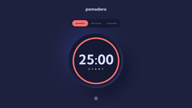

# Frontend Mentor - Pomodoro app solution

This is a solution to the [Pomodoro app challenge on Frontend Mentor](https://www.frontendmentor.io/challenges/pomodoro-app-KBFnycJ6G). Frontend Mentor challenges help you improve your coding skills by building realistic projects.

## Table of contents

- [Overview](#overview)
  - [The challenge](#the-challenge)
  - [Screenshots](#screenshots)
  - [Links](#links)
- [My process](#my-process)
  - [Built with](#built-with)
  - [What I learned](#what-i-learned)

## Overview

### The challenge

Users should be able to:

- Set a pomodoro timer and short & long break timers
- Customize how long each timer runs for
- See a circular progress bar that updates every minute and represents how far through their timer they are
- Customize the appearance of the app with the ability to set preferences for colors and fonts

### Screenshots

#### Mobile layout

| Main                                                                                | Settings                                                                                              |
| ----------------------------------------------------------------------------------- | ----------------------------------------------------------------------------------------------------- |
| <a href="./screenshots/mobile.png"></a> | <a href="./screenshots/mobile-settings.png"></a> |

#### Tablet layout

| Main                                                                                | Settings                                                                                              |
| ----------------------------------------------------------------------------------- | ----------------------------------------------------------------------------------------------------- |
| <a href="./screenshots/tablet.png"></a> | <a href="./screenshots/tablet-settings.png"></a> |

#### Desktop layout

| Main                                                                                  | Settings                                                                                                |
| ------------------------------------------------------------------------------------- | ------------------------------------------------------------------------------------------------------- |
| <a href="./screenshots/desktop.png"></a> | <a href="./screenshots/desktop-settings.png"></a> |

### Links

- Solution URL: [Add solution URL here](https://your-solution-url.com)
- Live Site URL: https://kenyontu.github.io/frontend-mentor-pomodoro-app

## My process

### Built with

- Semantic HTML5 markup
- CSS custom properties
- Flexbox
- CSS Grid
- Mobile-first workflow
- [React](https://reactjs.org/) - JS library

### What I learned

#### Fixed-width numbers

When dealing with timers, if the numbers in the font family are not monospaced, they will make the timer's text move around when the time changes. It's ideal to have each digit occupy the same width, so that they stay in place when changed.

The easy ways to solve this would be to use a monospaced font family or use the `font-variant-numeric: tabular-num` CSS property. But the challenge gives us 3 options of font families, 2 of which are not monospaced and they also do not support `font-variant-numeric`.

Without the above options, I solved it by wrapping each digit with a `span` and setting its `width` to `1ch`.

Example:

```html
<p>
  <span class="digit">1</span>
  <span class="digit">2</span>
</p>
```

```css
.digit {
  display: inline-block;
  width: 1ch;
}
```

Since this causes issues with screen readers, we can add `aria-hidden` to the digits and add a `span` containing the non-splitted number and make it visible to screen readers only:

```html
<p>
  <span class="sr-only">12</span>
  <span class="digit" aria-hidden>1</span>
  <span class="digit" aria-hidden>2</span>
</p>
```
